# Git y Bookdown 

## ¿Cómo suscribirte a Git?

Para crear una cuenta en GitHub, ingresamos al enlace: [pulsa aquí para dirigirte a la página https://github.com](https://github.com)

1.- Ingresamos nuestro nombre de usuario, correo electrónico, contraseña y confirmamos contraseña.

2.- Una vez ingresado los datos, opriminos el botón "Create an account".

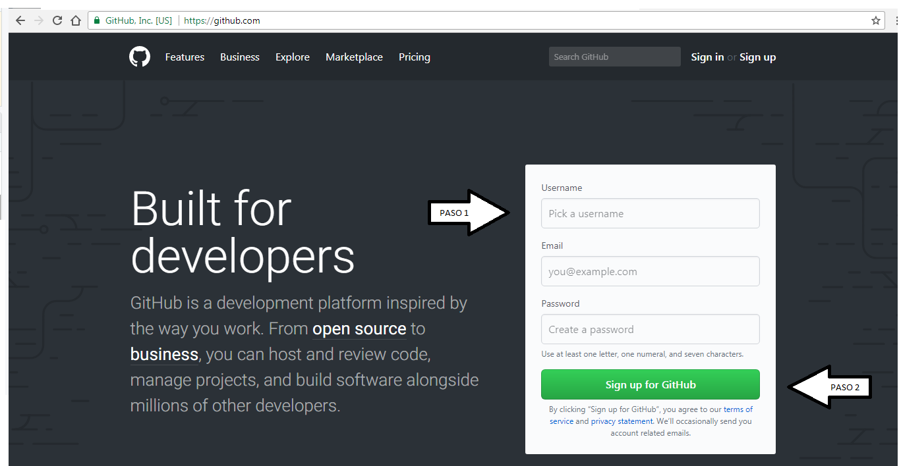

## Encontrar repositorio en GitHub

1.- Entrar en GitHub con tu cuenta.

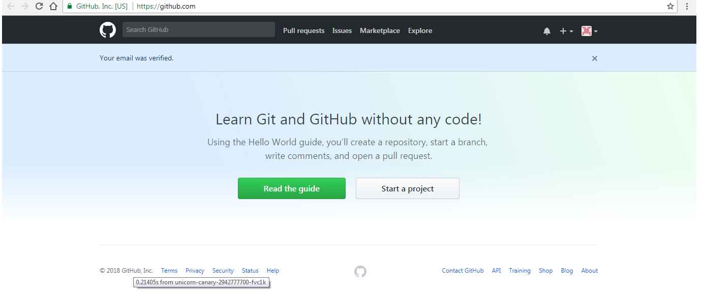

2.- Colocar en el buscador synergyvision/colaboradores.

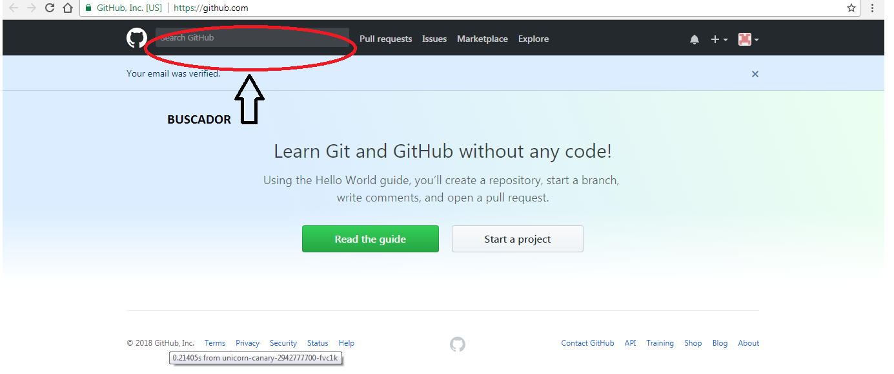

Donde synergy vision representa la organización y colaboradores es el repositorio a descargar.

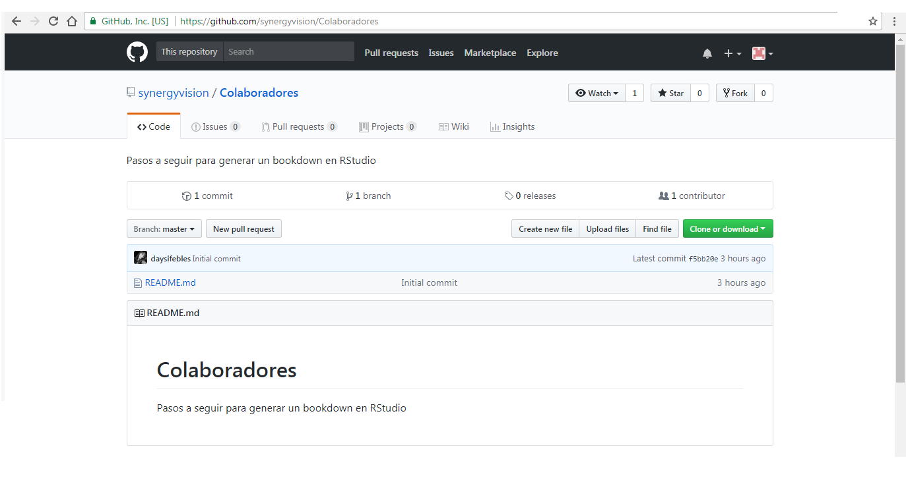

3.- Ubicarse en 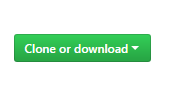

4.- Darle un clip y copiar el enlace para luego clonarlo en RStudio 

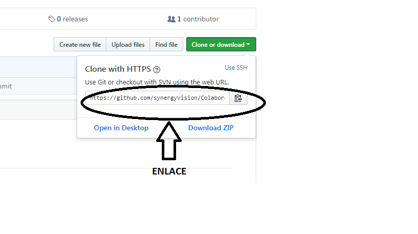

## Clonar repositorio en RStudio

1.- Abrir RStudio

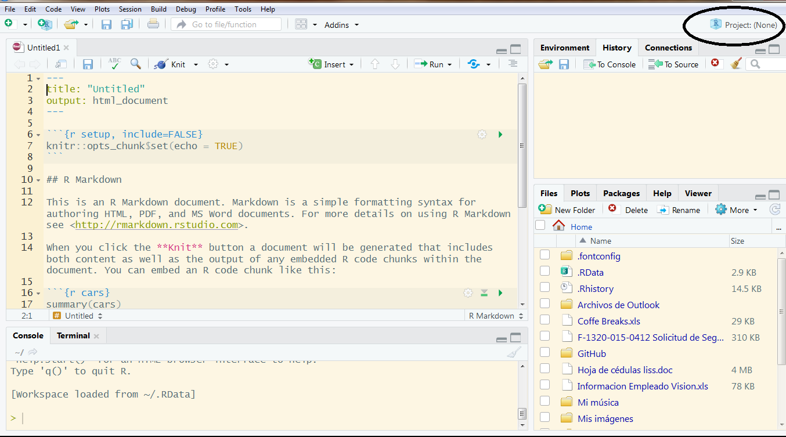

2.- Colocarse en la barra de herramientas del lado derecho, dar clip a New Project

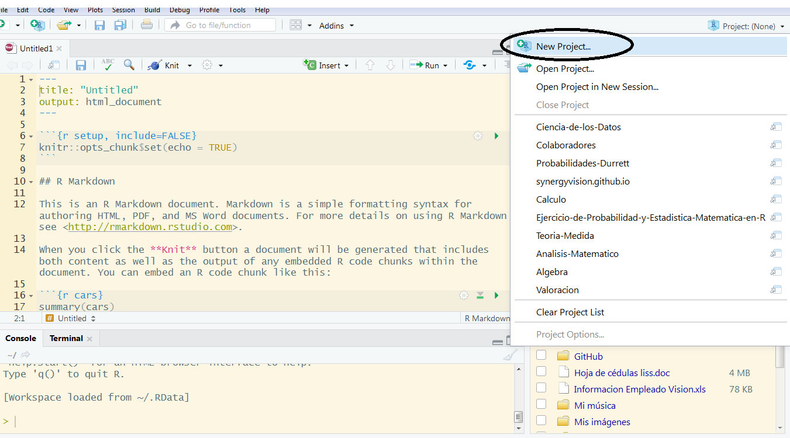

3.- Dar clip en Version Control

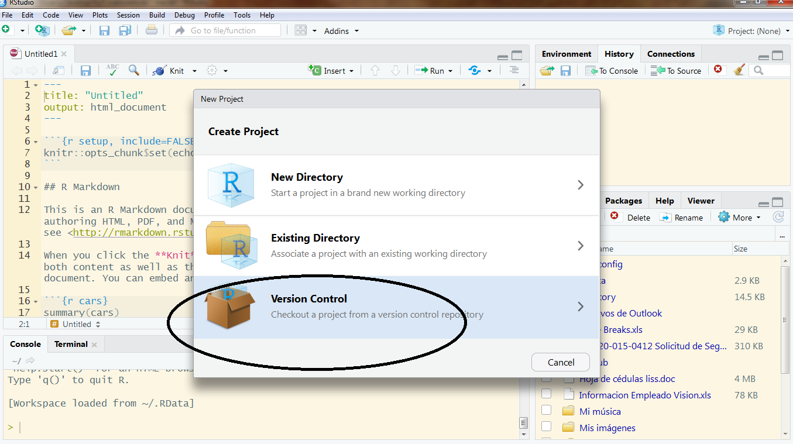

4.- Dar clip en Git

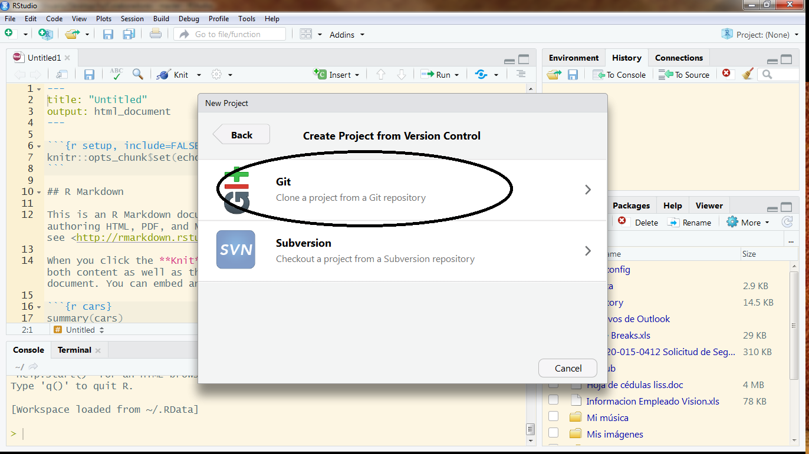

5.- En esta pantalla debes realizar 2 pasos y son los siguientes:

a) Copiar el enlace que traes de GitHub en Repository URL

b) En Project directory name, debe colocar el nombre del proyecto (Colaboradores) sin espacio ni caracteres especiales, prestando atención de la dirección donde se está guardando el proyecto (para ubicaciones futuras).

c) Darle un clip en Create Project.

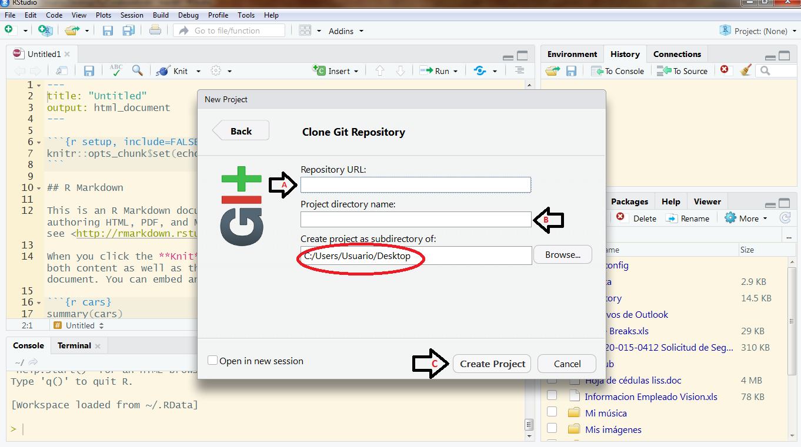

## ¿Cómo trabajar en bookdown?

1.- Una vez descargado el repositorio, encontrarán entre los archivos una carpeta que se llama bookdown.

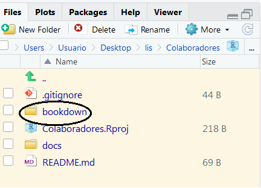

2.- En la carpeta bookdown se colocarán los capítulos generados para la creación de cada libro, las imagenes y datos referentes al mismo. Por ejemplo:

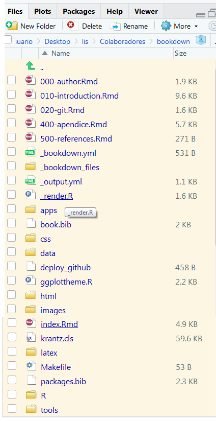

2.1. La numeración consecutiva es para que el archivo index.Rmd relacione los capítulos del libro, en este ejemplo existe un único capítulo que es Git y en él se encuentran todos los pasos que estás leyendo.

Si necesitas crear un nuevo capítulo debes generar un archivo.Rmd colocando una numeración consecutiva como por ejemplo 030-(nombre) y así sucesivamente.

2.2. Los archivoss .yml generan la estructura que tendrá el libro por consiguiente no deben cambiarse.

2.3. La carpeta data debe contener archivos que guarden datos, los cuales pueden llegar a necesitarse para algún ejemplo o ejercicio a desarrollar dentro del libro, ejemplo un archivo.xls.

2.4. La carpeta images es para guardar las imágenes que serán usadas en el libro.

2.5. El archivo 010-introduccion.Rmd debe contener la introducción del libro. El archivo 400-apendice.Rmd, debe contener los apendices del libro y el archivo 500-references.Rmd, debe contener las referencias bibliográficas usadas.

3.- Generación de vista previa, en primer lugar se debe guardar los cambios realizados, luego abrir el archivo index.Rmd para generar la vista previa del libro y ver los cambios realizados. Se realiza de la siguiente manera

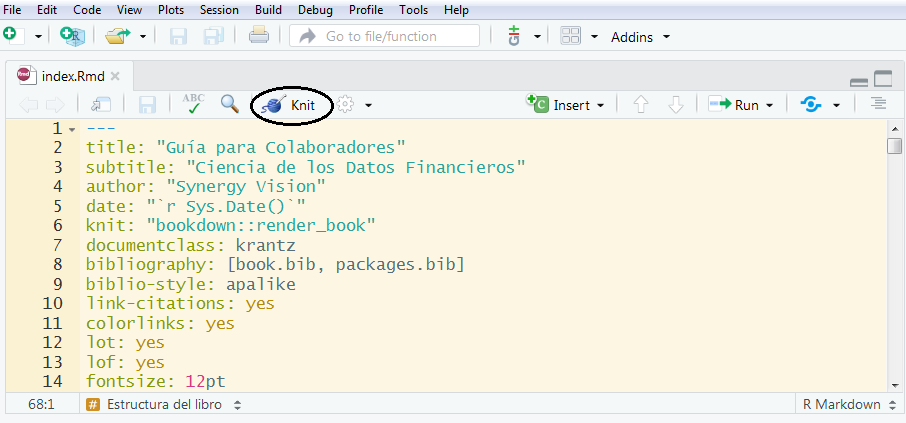

Esto debe generar un .html. A continuación se le presentará una vista previa

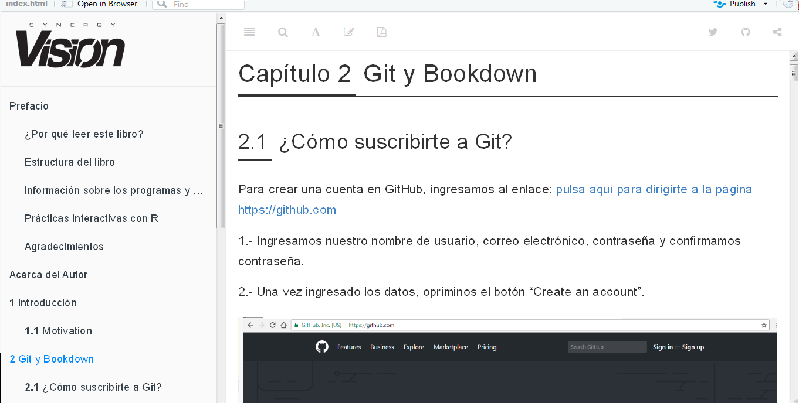

cambio
