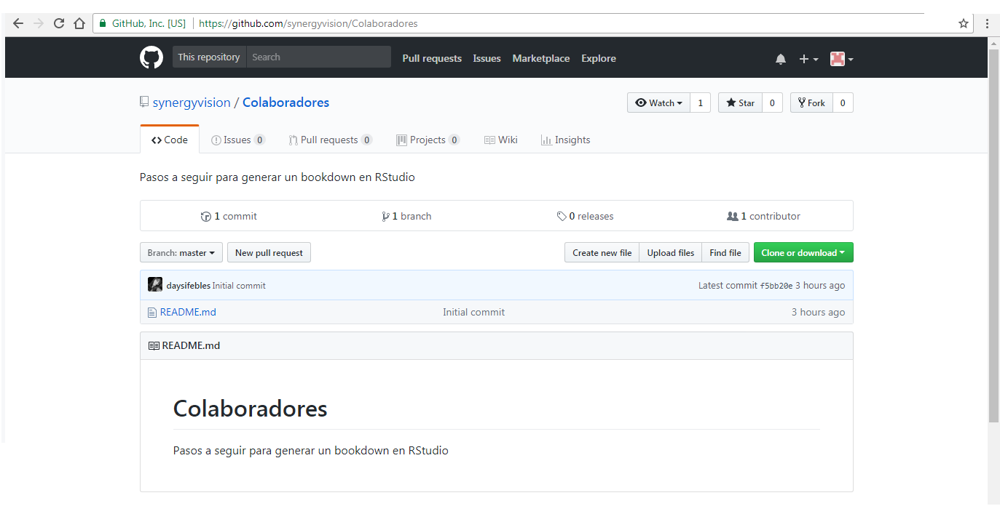
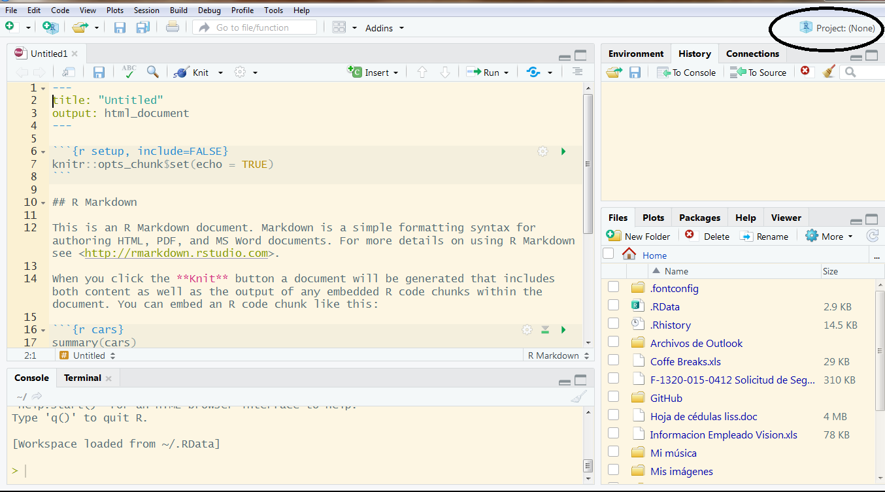
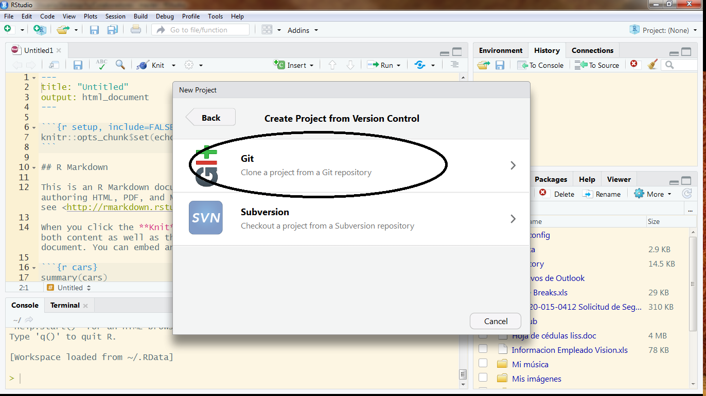
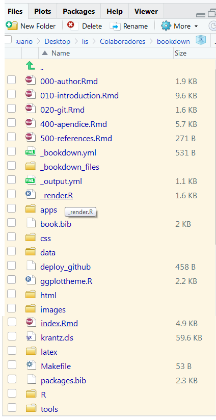

# Renta Fija
Synergy Vision  
`r Sys.Date()`  

# Prefacio {-}

Placeholder

## ¿Por qué  leer este libro? {-}
## Estructura del libro {-}
## Información sobre los programas y convenciones {-}
## Prácticas interactivas con R {-}
## Agradecimientos {-}

<!--chapter:end:index.Rmd-->

# Acerca del Autor {-}

Este material es un esfuerzo de equipo en Synergy Vision, (<http://synergy.vision/nosotros/>).		 

El propósito de este material es ofrecer una experiencia de aprendizaje distinta y enfocada en el estudiante. El propósito es que realmente aprenda y practique con mucha intensidad. La idea es cambiar el modelo de clases magistrales y ofrecer una experiencia más centrada en el estudiante y menos centrado en el profesor. Para los temas más técnicos y avanzados es necesario trabajar de la mano con el estudiante y asistirlo en el proceso de aprendizaje con prácticas guiadas, material en línea e interactivo, videos, evaluación contínua de brechas y entendimiento, entre otros, para procurar el dominio de la materia.
  		  
Nuestro foco es la Ciencia de los Datos Financieros y para ello se desarrollará material sobre: **Probabilidad y Estadística Matemática en R**, **Programación Científica en R**, **Mercados**, **Inversiones y Trading**, **Datos y Modelos Financieros en R**, **Renta Fija**, **Inmunización de Carteras de Renta Fija**, **Teoría de Riesgo en R**, **Finanzas Cuantitativas**, **Ingeniería Financiera**, **Procesos Estocásticos en R**, **Series de Tiempo en R**, **Ciencia de los Datos**, **Ciencia de los Datos Financieros**, **Simulación en R**, **Desarrollo de Aplicaciones Interactivas en R**, **Minería de Datos**, **Aprendizaje Estadístico**, **Estadística Multivariante**, **Riesgo de Crédito**, **Riesgo de Liquidez**, **Riesgo de Mercado**, **Riesgo Operacional**, **Riesgo de Cambio**, **Análisis Técnico**, **Inversión Visual**, **Finanzas**, **Finanzas Corporativas**, **Valoración**, **Teoría de Portafolio**, entre otros.

Nuestra cuenta de Twitter es (https://twitter.com/bysynergyvision) y nuestros repositorios están en GitHub (https://github.com/synergyvision).
  		  
 **Somos Científicos de Datos Financieros**

<!--chapter:end:000-author.Rmd-->

# Introducción 

Placeholder

## Motivation

<!--chapter:end:010-introduction.Rmd-->

# ¿Cómo suscribirte a Git?

Para crear una cuenta en GitHub, ingresamos al enlace: [pulsa aquí para dirigirte a la página https://github.com](https://github.com)

1.- Ingresamos nuestro nombre de usuario, correo electrónico, contraseña y confirmamos contraseña.

2.- Una vez ingresado los datos, opriminos el botón "Create an account".

## Encontrar repositorio en GitHub

1.- Entrar en GitHub con tu cuenta.

2.- Colocar en el buscador synergyvision/colaboradores.

Donde synergy vision representa la organización y colaboradores es el repositorio a descargar.

3.- Ubicarse en 

4.- Darle un clip y copiar el enlace para luego clonarlo en RStudio 

### Clonar repositorio en RStudio

1.- Abrir RStudio

2.- Colocarse en la barra de herramientas del lado derecho, dar clip a New Project

3.- Dar clip en Version Control

4.- Dar clip en Git

5.- En esta pantalla debes realizar 2 pasos y son los siguientes:

a) Copiar el enlace que traes de GitHub en Repository URL

b) En Project directory name, debe colocar el nombre del proyecto (Colaboradores) sin espacio ni caracteres especiales, prestando atención de la dirección donde se está guardando el proyecto (para ubicaciones futuras).

c) Darle un clip en Create Project.

### ¿Cómo trabajar en bookdown?

1.- Una vez descargado el repositorio, encontrarán entre los archivos una carpeta que se llama bookdown.

2.- En la carpeta bookdown se colocarán los capítulos generados para la creación de cada libro, las imagenes y datos referentes al mismo. Por ejemplo:

2.1. La numeración consecutiva es para que el archivo index.Rmd relacione los capítulos del libro, en este ejemplo existe un único capítulo que es Git y en él se encuentran todos los pasos que estás leyendo.

Si necesitas crear un nuevo capítulo debes generar un archivo.Rmd colocando una numeración consecutiva como por ejemplo 030-(nombre) y así sucesivamente.

2.2. Los archivoss .yml generan la estructura que tendrá el libro por consiguiente no deben cambiarse.

2.3. La carpeta data debe contener archivos que guarden datos los cuales pueden llegar a necesitarse para algún ejemplo o ejercicio a desarrollar dentro del archivo, ejemplo un archivo.xls.

2.4. La carpeta imágenes es para guardar la imágenes que serán usadas.

<!--chapter:end:020-git.Rmd-->

# (APPENDIX) Apéndice {-}

Placeholder

# Software Tools

Placeholder

## R and R packages
## Pandoc
## LaTeX

<!--chapter:end:400-apendice.Rmd-->

# Referencias {-}

<!--chapter:end:500-references.Rmd-->

