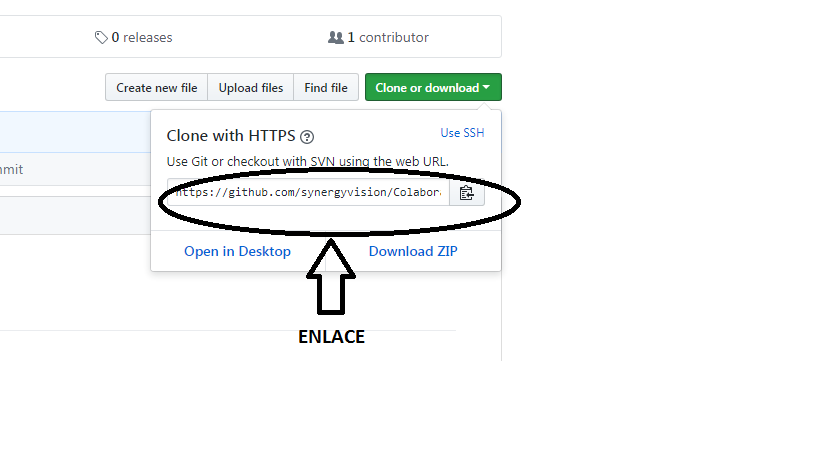
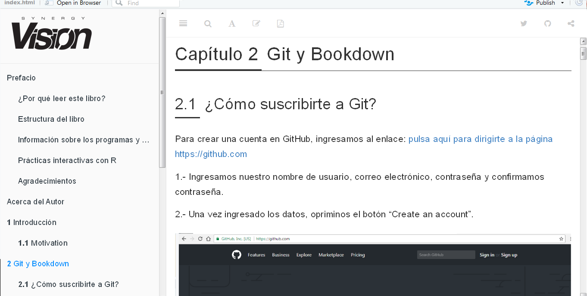
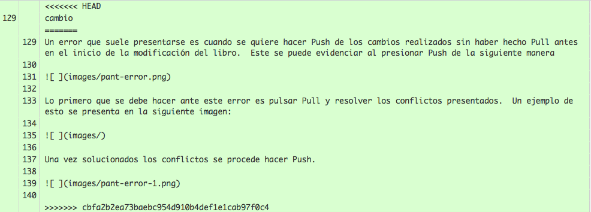

<script src="https://cdn.datacamp.com/datacamp-light-latest.min.js"></script>

--- 
title: "Guía para Colaboradores"
subtitle: "Ciencia de los Datos Financieros"
author: "Synergy Vision"
date: "2019-02-10"
knit: "bookdown::render_book"
documentclass: krantz
bibliography: [book.bib, packages.bib]
biblio-style: apalike
link-citations: yes
colorlinks: yes
lot: yes
lof: yes
fontsize: 12pt
monofontoptions: "Scale=0.8"
keep_md: yes
site: bookdown::bookdown_site
description: ""
url: 'https\://synergy.vision/Colaboradores/'
github-repo: synergyvision/Colaboradores/
cover-image: images/cover.png
---


# Prefacio {-}

<a href="https://synergy.vision/LibrosInteractivos/" target="_blank"></a>


  
La versión en línea de este libro se comparte bajo la licencia [Creative Commons Attribution-NonCommercial-ShareAlike 4.0 International License](http://creativecommons.org/licenses/by-nc-sa/4.0/).

## ¿Por qué  leer este libro? {-}

Esta guía es para orientar a los colaboradores de Synergy Vision en las herramientas de trabajo que utilizamos todos los días y hacernos más productivos, protegiendo el contenido que generamos y presentándolo de la manera más profesional posible.

Se presenta el uso de la herramienta `git` a través de **github.com** y también de cómo se puede conectar con `RStudio`.

Esta guía es pública ya que las herramientas que usamos para ensamblarlo son abiertas y públicas.

Esperamos sea de utilidad.

## Información sobre los programas y convenciones {-}

Este libro es posible gracias a una gran cantidad de desarrolladores que contribuyen en la construcción de herramientas para generar documentos enriquecidos e interactivos. En particular al autor de los paquetes Yihui Xie xie2015.

## Prácticas interactivas con R {-}

Vamos a utilizar el paquete [Datacamp Tutorial](https://github.com/datacamp/tutorial) que utiliza la librería en JavaScript [Datacamp Light](https://github.com/datacamp/datacamp-light) para crear ejercicios y prácticas con `R`. De esta forma el libro es completamente interactivo y con prácticas incluidas. De esta forma estamos creando una experiencia única de aprendizaje en línea.

<div data-datacamp-exercise data-height="300" data-encoded="true">eyJsYW5ndWFnZSI6InIiLCJwcmVfZXhlcmNpc2VfY29kZSI6ImIgPC0gNSIsInNhbXBsZSI6IiMgQ3JlYSB1bmEgdmFyaWFibGUgYSwgaWd1YWwgYSA1XG5cblxuIyBNdWVzdHJhIGVsIHZhbG9yIGRlIGEiLCJzb2x1dGlvbiI6IiMgQ3JlYSB1bmEgdmFyaWFibGUgYSwgaWd1YWwgYSA1XG5hIDwtIDVcblxuIyBNdWVzdHJhIGVsIHZhbG9yIGRlIGFcbmEiLCJzY3QiOiJ0ZXN0X29iamVjdChcImFcIilcbnRlc3Rfb3V0cHV0X2NvbnRhaW5zKFwiYVwiLCBpbmNvcnJlY3RfbXNnID0gXCJBc2VnJnVhY3V0ZTtyYXRlIGRlIG1vc3RyYXIgZWwgdmFsb3IgZGUgYGFgLlwiKVxuc3VjY2Vzc19tc2coXCJFeGNlbGVudGUhXCIpIn0=</div>


## Agradecimientos {-}

A todo el equipo de Synergy Vision que no deja de soñar. Hay que hacer lo que pocos hacen, insistir, insistir hasta alcanzar. Lo más importante es concretar las ideas. La idea es sólo el inicio y solo vale cuando se concreta.


\BeginKnitrBlock{flushright}<p class="flushright">Synergy Vision, Caracas, Venezuela</p>\EndKnitrBlock{flushright}


<!--chapter:end:index.Rmd-->


# Acerca del Autor {-}

Este material es un esfuerzo de equipo en Synergy Vision, (<https://synergy.vision/nosotros/>).		 

El propósito de este material es ofrecer una experiencia de aprendizaje distinta y enfocada en el estudiante. El propósito es que realmente aprenda y practique con mucha intensidad. La idea es cambiar el modelo de clases magistrales y ofrecer una experiencia más centrada en el estudiante y menos centrado en el profesor. Para los temas más técnicos y avanzados es necesario trabajar de la mano con el estudiante y asistirlo en el proceso de aprendizaje con prácticas guiadas, material en línea e interactivo, videos, evaluación contínua de brechas y entendimiento, entre otros, para procurar el dominio de la materia.
  		  
Nuestro foco es la Ciencia de los Datos Financieros y para ello se desarrollará material sobre: **Probabilidad y Estadística Matemática en R**, **Programación Científica en R**, **Mercados**, **Inversiones y Trading**, **Datos y Modelos Financieros en R**, **Renta Fija**, **Inmunización de Carteras de Renta Fija**, **Teoría de Riesgo en R**, **Finanzas Cuantitativas**, **Ingeniería Financiera**, **Procesos Estocásticos en R**, **Series de Tiempo en R**, **Ciencia de los Datos**, **Ciencia de los Datos Financieros**, **Simulación en R**, **Desarrollo de Aplicaciones Interactivas en R**, **Minería de Datos**, **Aprendizaje Estadístico**, **Estadística Multivariante**, **Riesgo de Crédito**, **Riesgo de Liquidez**, **Riesgo de Mercado**, **Riesgo Operacional**, **Riesgo de Cambio**, **Análisis Técnico**, **Inversión Visual**, **Finanzas**, **Finanzas Corporativas**, **Valoración**, **Teoría de Portafolio**, entre otros.

Nuestra cuenta de Twitter es (https://twitter.com/bysynergyvision) y nuestros repositorios están en GitHub (https://github.com/synergyvision).
  		  
 **Somos Científicos de Datos Financieros**

<!--chapter:end:000-author.Rmd-->

\mainmatter

# Introducción 

En el presente material encontrarán el como suscribirse a `Git`, luego se indicará paso a paso como hallar un repositorio dentro de `GitHub`, clonar el archivo para poder manipularlos en `RStudio`.

Una vez clonados los archivos se indicará como modificarlos, como realizar cambios y subirlos a `Github`  paso a paso, además como subir nuevo contenido y bajar y actualizar nuestro repositorio local con los cambios que esten en `Github`.

Además se demuestra como trabajar en Bookdown de forma detallada.

Cabe destacar que cada colaborador tendrá un repositorio con las fuentes necesarias para generar su libro.


<!--chapter:end:010-introduction.Rmd-->

# Git y Bookdown 

## ¿Cómo suscribirte a Git?

Para crear una cuenta en GitHub, ingresa al enlace siguiente [https://github.com](https://github.com)

1.- Ingresamos nuestro nombre de usuario, correo electrónico, contraseña y confirmamos contraseña.

2.- Una vez ingresado los datos, opriminos el botón "Create an account".


## Encontrar repositorio en GitHub

1.- Entrar en GitHub con tu cuenta.


2.- Colocar en el buscador synergyvision/colaboradores.


Donde synergy vision representa la organización y colaboradores es el repositorio a descargar.


3.- Ubicarse en 

4.- Hacer click y copiar el enlace para luego clonarlo en RStudio 



## Clonar repositorio en RStudio

1.- Abrir RStudio


2.- Colocarse en la barra de herramientas del lado derecho, hacer click a New Project


3.- Hacer click en Version Control


4.- Hacer click en Git


5.- En esta pantalla debes realizar 2 pasos y son los siguientes:

a) Copiar el enlace que traes de GitHub en Repository URL

b) En Project directory name, debe colocar el nombre del proyecto (Colaboradores) sin espacio ni caracteres especiales, prestando atención de la dirección donde se está guardando el proyecto (para ubicaciones futuras).

c) Hacer click en Create Project.


## ¿Cómo trabajar en bookdown?

1.- Una vez descargado el repositorio, encontrarán entre los archivos una carpeta que se llama bookdown.


2.- En la carpeta bookdown se colocarán los capítulos generados para la creación de cada libro, las imagenes y datos referentes al mismo. Por ejemplo:


2.1. La numeración consecutiva de los archivos .Rmd es para que el archivo index.Rmd relacione los capítulos del libro, en este ejemplo existe un único capítulo que es "Git y Bookdown" (020-git.Rmd) y en él se encuentran todos los pasos que estás leyendo.

Si necesitas crear un nuevo capítulo debes generar un archivo.Rmd colocando una numeración consecutiva como por ejemplo 030-(nombre) y así sucesivamente.

2.2. Los archivos .yml generan la estructura que tendrá el libro por consiguiente no deben cambiarse.

2.3. La carpeta **data** debe contener archivos que guarden datos, los cuales pueden llegar a necesitarse para algún ejemplo o ejercicio a desarrollar dentro del libro, ejemplo un archivo.xls.

2.4. La carpeta **images** es para guardar las imágenes que serán usadas en el libro.

2.5. El archivo 010-introduccion.Rmd debe contener la introducción del libro. El archivo 400-apendice.Rmd, debe contener los apendices del libro y el archivo 500-references.Rmd, debe contener las referencias bibliográficas usadas.


3.- Generación de vista previa, en primer lugar se debe guardar los cambios realizados, luego abrir el archivo index.Rmd para generar la vista previa del libro y ver los cambios realizados. Se realiza de la siguiente manera


Esto debe generar un .html. A continuación se le presentará una vista previa



4.- ¿Cómo hacer commit?

Una vez realizado cualquier cambio en el libro es necesario guardarlos en el proyecto, para ello utilizaremos la herramienta .


4.1. Seleccionar los archivos modificados: en este paso solo se deben seleccionar la fuente trabajada (archivos.Rmd), imágenes, archivos de data. No serán seleccionar los archivos que se generan cuando se corre el libro (.html,.md, .json).

4.2. Hacer comentarios sobre los cambios realizados: aqui colocarán los cambios que se hayan hecho dentro del proyecto. Por ejemplo "creación bookdown colaboradores".

4.3. Luego pulsar en Commit.

4.4. Pulsar push para subir los cambios del proyecto a la nube.

**Observación:** Este tipo herramientas facilita el manejo de un mismo proyecto entre varios colaboradores, pudiendo agregar cambio a un mismo archivo bajo las modificaciones ya hechas sin afectar el trabajo del otro. Lo primero que se debe hacer cuando se trabaja en este tipo de proyecto es Pull (bajar los cambios realizados, los cuales estarán montados en la nube), para no generar errores en los archivos.

Seguidamente se realizan los pasos 4.1, 4.2, 4.3 y 4.4 respectivamente.


En el recuadro inferior destacan dos colores donde rojo es lo que estaba descrito anteriormente y el verde es el que contiene los cambios.

## Errores comunes 

Un error que suele presentarse es cuando se quiere hacer Push de los cambios realizados sin haber hecho Pull antes en el inicio de la modificación del libro.  Este se puede evidenciar al presionar Push de la siguiente manera


Lo primero que se debe hacer ante este error es pulsar Pull y resolver los conflictos presentados. Por ejemplo



Se debe ir al archivo que contiene el conflicto y eliminar los carácteres que fueron agregados, luego hacer Commit de las modificaciones.

Una vez solucionados los conflictos se procede hacer Push.


<!--chapter:end:020-git.Rmd-->

# Teoremas y pruebas

Los teoremas y pruebas se utilizan comúnmente en artículos y libros en matemáticas. 
En bookdown, los tipos de entornos de teorema admitidos se encuentran en la siguiente tabla para escribir un teorema, puede usar la siguiente sintaxis:

` ```{theorem} `

` Aquí está mi teorema `

` ``` `

| Environment | Printed Name | Label Prefix |
|:-----------:|:------------:|:------------:|
|   theorem   |    Teorema   |      thm     |
|    lemma    |     Lemma    |      lem     |
|  corollary  |   Corolario  |      cor     |
| proposition |  Preposición |      prp     |
|  conjecture |   Conjetura  |      cnj     |
|  definition |  Definición  |      def     |
|   example   |    Ejemplo   |      exm     |
|   exercise  |   Ejercicio  |      exr     |


Para escribir otros entornos de teorema, reemplace ` ```{teorema} ` con otros nombres de entorno como se mostró en la tabla anterior, por ejemplo,` ``` {lemma} `.

Un teorema puede tener una opción de nombre para que su nombre se imprima, por ejemplo,

` ```{theorem, name="Teorema de Pitágoras"} `

` Para un triángulo rectángulo, si $ c $ denota la longitud de la hipotenusa `

` y $ a $ y $ b $ denotan las longitudes de los otros dos lados, tenemos `

` $$ a ^ 2 + b ^ 2 = c ^ 2 $$ `

` ``` `

\BeginKnitrBlock{theorem}\iffalse{-91-84-101-111-114-101-109-97-32-100-101-32-80-105-116-225-103-111-114-97-115-93-}\fi{}<div class="theorem"><span class="theorem" id="thm:unnamed-chunk-8"><strong>(\#thm:unnamed-chunk-8)  \iffalse (Teorema de Pitágoras) \fi{} </strong></span> Para un triángulo rectángulo, si $ c $ denota la longitud de la hipotenusa
 y $ a $ y $ b $ denotan las longitudes de los otros dos lados, tenemos
 $$ a ^ 2 + b ^ 2 = c ^ 2 $$ </div>\EndKnitrBlock{theorem}

Para hacer una referencia sobre el teorema se debe colocar label=nombre que se le quiera colocar al teorema.

` ```{theorem, label="foo"} `

` Este es mi teorema  `

` ``` `

\BeginKnitrBlock{theorem}<div class="theorem"><span class="theorem" id="thm:foo"><strong>(\#thm:foo) </strong></span>
Este es mi teorema
</div>\EndKnitrBlock{theorem}

Para hacer referencia utilizando label se hace con el comando `\@ref(prefix:label)`, en este caso el prefix=thm que corresponde a teorema.  Para utilizar el ejemplo antes descrito colocamos label=foo.

` \@ref(thm:foo)`

\@ref(thm:foo)


<!--chapter:end:030-teorema-pruebas.Rmd-->

